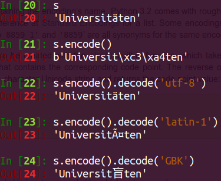
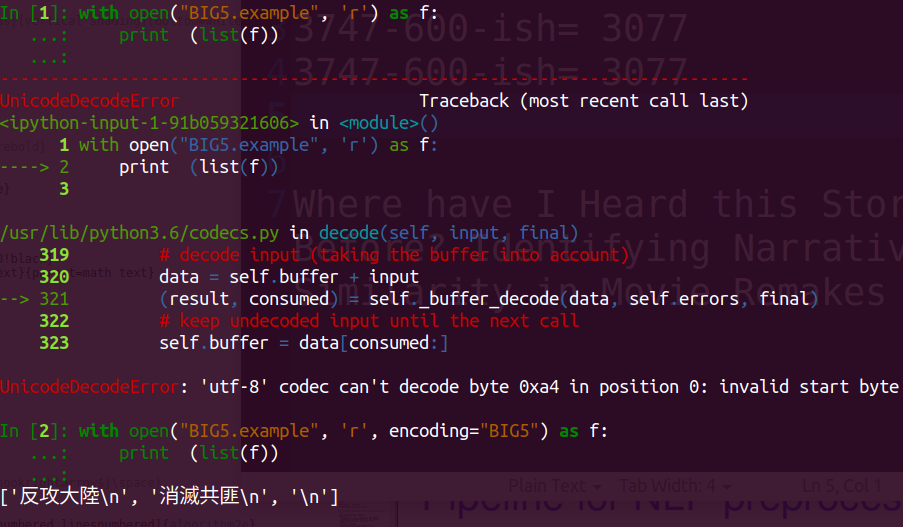
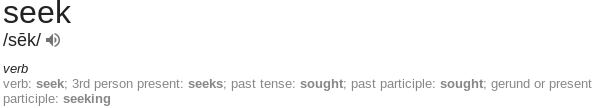
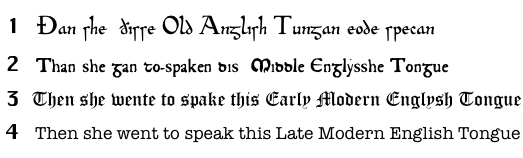

# 
Add a figure of Rosetta stone 

# Text encoding in Computers
::: columns

:::: {.column width=60%}
* The written system of a language is called a **script**. Many languages do not have written systems. 
* Script elements, e.g., characters, are **encoded**, usually into integers, for storage and representation in computers. 
* For example, in ASCII 95 means "A". 
* ASCII -- Ever wonder why you cannot use certain characters in usernames or passwords? 
* Not every language uses the Latin alphabet. Encoding matters. 
* Local encodings in Europe and Asia
* Then the birth of Unicode, e.g., UTF8 
::::

:::: {.column width=40%}
{width=80%}
::::

:::


# Text encoding in Python3
  

::: columns

:::: {.column width=50%}
* [In Python 3, a string is by default in UTF-8. ](https://docs.python.org/3/howto/unicode.html)
* This is a huge change from Python 2 to 3. 
* Python 3 has a separate type for strings, bytes.
* When opening a file, ensure the encoding. 
::::

:::: {.column width=50%}
{width=100%}
::::

:::

# Unicode can make NLP throny
* It simply concatenates different encoding systems. Thus, some symbols are encoded multiple times, there is a cross (U+07d9) in Nko, while there many other crosses in Unicode. How many commas in Unicode? 
* Invisible characters. 
* Potential adverserial attack by using code in different parts of Unicode.
    * [Bad‌‌‌‌‌‌‌‌‌‌‌‌‌‌‌‌‌‌‌‌‌‌‌‌‌‌‌‌‌‌‌‌‌‌‌‌‌‌‌‌‌‌‌‌‌‌‌‌‌‌‌‌‌‌‌‌‌‌‌‌‌‌‌‌‌‌‌‌‌‌‌‌‌‌‌‌‌‌‌‌‌‌‌‌‌‌‌‌‌‌‌‌‌‌‌ Characters: Imperceptible NLP Attacks, Boucher et al., 2021](https://arxiv.org/pdf/2106.09898.pdf)
    * [Hey, AI software developers, you are taking Unicode into account, right ... right?](https://www.theregister.com/2021/08/06/unicode_ai_bug/)


# Unicode and CJK I 


::: columns

:::: {.column width=40%}
* Text is NOT always 1D arrays. 
* Exceptions include Chinese, Korean and Japanese (CJK), where building blocks (stokes, radicals, jamos) are combined in 2D before expanding to 1D arrays.
* Some papers: Stratos, A Sub-Character Architecture for Korean Language Processing, EMNLP 2017
::::

:::: {.column width=60%}
{width=50%}
{width=50%}
::::

:::


# Unicode and CJK II 
* Hence, encoding characters individually is inefficient. Imaging that you have to encode every word in English using a unique code. You would need $\log_2 {50000}$ bits. 
  {width=40%}
* For CJK, Unicode has 48 strokes (U+31C0..U+31EF), 224 radicals (U+2F00..U+2FDF) and 12 ideographic description characters (U+2FF0..U+2FFF). But it still  encodes each character! 

# Beyond plain text
Some text data are more than __plain text__, including information about formatting and field/structure. 

* PDF: font and coordinate for each character -- no strings
* Markup languages: HTML, XML (including Microsoft Office XML). Easier but not that easy: e.g., the same type of information is in different tags or tags of different attributes, e.g., 
  ```html
   <a href="a.html" id="first_link">Go back</a>
   <a href="b.html" id="second_link">Next</a> 
  ```
* (The evil) Microsoft formats (prior to Office XML)
* Dictionary-like data: YAML, JSON
* Text from charts and text from tables 

# Preprocessing steps in NLP
1. Get your data (e.g., crawl, scrape)
2. Extract the part you want (e.g., finding abstracts of papers from )
3. Clean up (e.g., fixing typos) 
4. Tokenization 
5. Normalization (e.g., stemming/lemmatization, uncasing)

# Corpora (pl. of __corpus__)
* A corpus is a collection of text data. 
* E.g., all articles on Wikipedia form a corpus. 
* E.g., all news from a newspaper form another corpus. 
* E.g., All ACL papers form a corpus -- [Hot off the press](https://github.com/shauryr/ACL-anthology-corpus)
* Many NLP/DL libraries have made corpora easily accessible: 
    * [NLTK corpus](https://www.nltk.org/nltk_data/) -- Salute to the pioneers
    * [Tensorflow Datasets](https://www.tensorflow.org/datasets/catalog/overview)
    * [Huggingface Datasets](https://huggingface.co/datasets)

# Try it out yourself

```
import tensorflow_datasets as tfds 

for piece in tfds.load("cnn_dailymail",split="test"): 
    print (piece['article']) 
    break 

for piece in tfds.load("billsum",split="test"): 
    print (piece['text']) 
    break 

for piece in tfds.load("big_patent",split="test"): 
    print (piece['description']) 
    break
```

# Corpora are diverse
* In terms of content, domain, representation, etc. 
* Some more examples
  * http://jmcauley.ucsd.edu/data/amazon/
  * https://webscope.sandbox.yahoo.com/catalog.php?datatype=l
  * https://www.cs.uic.edu/~liub/FBS/sentiment-analysis.html\#datasets
  * https://catalog.ldc.upenn.edu/ldc2008t19

# A corpus can contain noise -- should you clean up?
* They could contain HTML tags or even unmatched HTML tags
* They could contain ads in news website data 
* Example: [Cornell Newsroom's human evaluation part](https://github.com/lil-lab/newsroom/blob/master/humaneval/newsroom-human-eval.csv)

# Constructing a corpus: web and web APIs 
* Two ways to make HTTP requests: `GET` (data are in the URL) and `POST` (data is not in the URL)
* Command line tools `wget` or `curl`. Language bindings: e.g., Python's `urllib` (official) or `request`. 
  ```python
  >>> import urllib.request
  >>> response = urllib.request.urlopen('https://www.wikidata.org/w/api.php?action=wbgetentities&props=labels&ids=Q2283&languages=en&format=json')
  >>> response.read()
  b'{"entities":{"Q2283":{"type":"item","id":"Q2283","labels":{"en":{"language":"en","value":"Microsoft"}}}},"success":1}'
  ```
* Set a timer to randomly do it. 
* Do NOT be too frequent. 

# Parsing HTML/XML
* Use `beautifulsoup`
* An HTML or XML file is a nested structure. 

# Regular expressions (regex)
 *  A regular expression defines how to generate a string by drawing characters from alphabets. You can draw characters from different sets at different "steps"''", like the example `abc)*(123)?` below. 
 *  `(a)*` means \{ $\epsilon$, a, aa, aaa, aaaa, ... \}, where $\epsilon$ is the empty string. 
 *  $(ab)*$ means \{ $\epsilon$, ab, abab, ababab, abababab, ... \}
 *  $(a|b)*$ means \{ $\epsilon$, a, b, ab, ba, aaa, aab, abb, bbb, bba, baa,  bab, ... \} where $|$ means ``or''. 
 *  $(a)+$ means \{ a, aa, aaa, \} because + means repeating at least once. 
 *  $(ab)?$ means \{ ab, $\epsilon$\} because ? means once or none. 
 *  $(abc)*(123)?$ means \{$\epsilon$, abc, abc123, abcabc, abcabc123, ... \} any string that begins with the string ``abc'' and ends with or without the string ``123''. 
 *  $0|(1|2|3|4|5|6|7|8|9)(0|1|2|3|4|5|6|7|8|9)+$ means any natural number in common writing format. Note that it does not allow an integer to start with 0. 

# Sentence segmentation 
* Breaking a string into sentences. 
* Also called sentence tokenization, although tokenization usually mean word tokenization. 
* Easy: Just split strings based on punctuations
* However, you may run into redundant punctuations in Unicode. 
* Hard: dot or period? -- Solution: write regex rules. 
* Can be done using rules or neurally. 

# (word) Tokenization
* Breaking a string into tokens, not necessarily words.
* `  "This is a class about NLP".split()`
* Lots of corner cases: 
  * "he isn't happy "
  * "We saw 2 people in the park after 3pm"
  * "Welcome to Columbia University in the City of New York."
* [A classic one](https://web.archive.org/web/19970614072242if_/http://www.cis.upenn.edu:80/~treebank/tokenization.html)

# Modern tokenizers
* WordPiece tokenizer -- made popular by BERT
* Nearly all HuggingFace models have a tokenizer component -- because they may encode tokens to different integers 
* Huggingface tokenizers have two version. `fast`, written in Rust, is available sometimes.

# Tokenization examples in NLTK

```python
In [1]: import nltk 

In [2]: nltk.tokenize.word_tokenize \ 
...: ("I am happy. mr. Wang is happy")
Out[2]: ['I', 'am', 'happy', '.', 'mr.', 'Wang', 'is', 
         'happy']

In [3]: nltk.tokenize.sent_tokenize \
   ...:  ("I am happy. mr. Wang is happy")
Out[3]: ['I am happy.', 'mr. Wang is also happy']

In [4]: nltk.tokenize.sent_tokenize \
   ...:  ("I am happy, mr. wang is happy")
Out[4]: ['I am happy, mr. wang is also happy']
```

Many other varieties at https://www.nltk.org/api/nltk.tokenize.html

# Tokenization in SpaCy

SpaCy enforces a pipeline approach. SpaCy's tokenization is rule-based. 

<!--  -->

```python
In [32]: nlp=spacy.load("en_core_web_sm", \
    ...: exclude=["tok2vec",'tagger','parser','ner', 'attribute_ruler', 'lemmatizer'])
    ...: nlp.add_pipe"sentencizer")        
Out[32]: <spacy.pipeline.sentencizer.Sentencizer at 0x7f487e80fdc0>

In [33]: [[sent.text for sent in doc.sents ]\
    ...:             for doc in nlp.pipe(\ 
    ...: ['today is monday. it is the first day.', 'soup is yammy. pizza sucks.'])]
Out[33]:
         [['today is monday.', 'it is the first day.'], 
          ['soup is yammy.', 'pizza sucks.']]

In [34]: [[word.text for word in doc ]
    ...:             for doc in nlp.pipe(\ 
    ...: ['today is monday. it is the first day.', 'soup is yammy. pizza sucks.'])]
Out[34]: [['today', 'is', 'monday', '.', 'it', 'is', 'the', 'first', 'day', '.'], 
          ['soup', 'is', 'yammy', '.', 'pizza', 'sucks', '.']]
```

# Tokenization in Stanza

Stanza, made by Stanford NLP group, is model-based. 

```python
In [1]: import stanza

In [2]: nlp = stanza.Pipeline(lang='en', processors='tokenize')

In [7]: sentences = 'i am very very happy. the weather is very good.'

In [8]: [[token.text for token in sentence.tokens] for sentence in nlp(sentences).sentences]
Out[8]: 
 [['i', 'am', 'very', 'very', 'happy', '.'],
  ['the', 'weather', 'is', 'very', 'good', '.']]

In [9]: [sentence.text for sentence in nlp(sentences).sentences]
Out[9]: ['i am very very happy.', 'the weather is very good.']
```

# Word segmentation in other languages
* More complex than in English 
* Chinese
* Japanese (very complicated, Kanji + Kana)
* Korean (Hanja, the chinese character part)
* Thai 
* Vietnamese
* Hold on, what about emoji? 

# Stemming and Lemmatizaiton 
*  The English language has inflexions, \textit{inflectional morphology}. We modify words for different grammatical purposes. "I give him a book" vs. "He gave me a book."
* The goal of stemming or lemmatization is to map morphologically related tokens to one canonical form, e.g., "him" to "he".
* **analytical langauges**: little or no inflectional morphology
  * **isolating languages**: no inflectional morphology
* **synthetic languages**: lots of morphemes 
* Most mainland, southeast Asian and Oceanic languages (Chinese -- especially classical Chinese, Vietnamese, Samoan, etc.) are isolating language. 
* English is an analytical language. Hence, stemming and lemmatization for English is relatively easy. 

# Stemming vs lemmatization
* Two tasks related, but slightly different. 
* Stemming: get the stem, e.g., removing the affix. 
* Lemmatization: get the lemma, the item word in a dictionary. 



# The English language is very messed-up

::: columns

:::: {.column width=50%}
{width=100%}
::::

:::: {.column width=50%}
"English irregular verbs"  are actually "regular verbs" in other Germanic languages.

{width=80%}
::::

:::


# Building a lemmatizer
* Take advantage of the dictionary
* What about words beyond? E.g., ``transformative'' vs. ``transforming'' 
* Don't take things for granted: NLTK's "WordNet lemmatizer only removes affixes if the resulting word is in its dictionary" which means that "lying" will not be restored back to "lie". 

# Downside of stemming and lemmatization
* By converting, e.g., "are", "is", "am" and "be" into "be", we lose information that may help use on other tasks. 
* Some combinations are meaningless when tokenized or lemmatized, e.g., in "I should have quited grad school when Sequoia gave me $2M", "should have quited" together mean something.
* Accurate lemmatization requires understanding the role of each word, e.g., the "saw" in "I saw the table (into half)" should be kept instead of being changed to "see."
* **Contemporary (2015 forward) NLP does NOT do lemmatization/stemming**  because the corpora are large enough. 

# Normalization
* Stemming or lemmatization is under the banner of normalization. 
* Normalization means restoring a word to its canonical form 
* For example, from upper case "University" to lower case "university".
* Many NLP models distinguish the cased and uncased one, e.g., [BERT's](https://github.com/google-research/bert/blob/eedf5716ce1268e56f0a50264a88cafad334ac61/run_classifier.py#L59)
* Another example of normalization is dealing with [punctuations or escape sequences](https://github.com/google-research/bert/blob/eedf5716ce1268e56f0a50264a88cafad334ac61/tokenization_test.py#L107). 
* And [accents](https://github.com/google-research/bert/blob/eedf5716ce1268e56f0a50264a88cafad334ac61/tokenization.py#L214)  

# Stop/background words 
* Some words occur so often in a language that **traditionally** (before Transformer in 2017) their presence does not help the downstream task, such as "is" or "the". 
* Example: you are building a spam mail filter. You want to count the frequencies of words and use the distribution to predict whether a mail is spam. Both spams and non-spams (hams) contain a lot of "the". 
* Such words are called stop words or background words. 
* The traditional approach is to remove them, replacing them with spaces. 
* However, the case for keeping  is emerging in **contemporary** NLP, thanks to the Transformers. [Ref1](https://github.com/google-research/bert/issues/1057) [Ref2](https://stackoverflow.com/questions/63633534/is-it-necessary-to-do-stopwords-removal-stemming-lemmatization-for-text-classif)

# Cloud APIs for syntactic analysis
* Google: https://cloud.google.com/natural-language/
* Microsoft: https://azure.microsoft.com/en-us/services/cognitive-services/text-analytics/ (no longer has syntactical features)